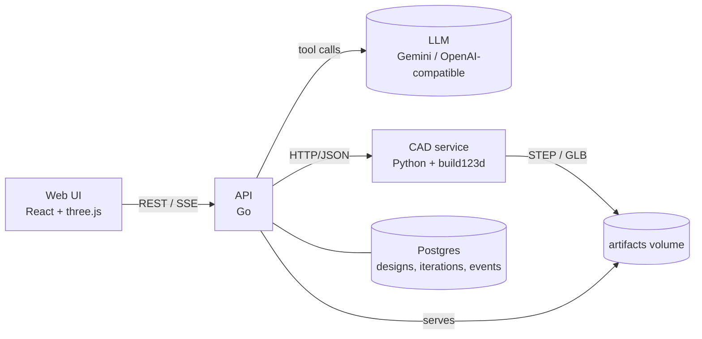

# Text → Spaceship

Describe a mission in plain English. An AI agent designs a **multi-part CubeSat assembly**, builds it in real CAD, checks it against engineering constraints, and iterates until it passes. You watch each iteration stream live in 3D, then download STEP and GLB files.

> A prototype for the UC Berkeley MEng × NASA capstone *Text to Spaceship: Building for NASA with Agentic Workflows* (target application: the Habitable Worlds Observatory).

**Why:** coding agents can make single CAD parts but struggle with assemblies. This project treats the assembly as a typed spec plus deterministic checks, so the agent gets exact, numeric feedback. See [ADR 0001](docs/adr/0001-spec-not-code.md).

## How it works



1. `POST /v1/designs` stores the prompt and starts the agent in a goroutine.
2. The agent gives the model the component catalog and the AssemblySpec JSON Schema, both served by the CAD service.
3. The model calls `build_and_validate(spec)`. The CAD service builds the solids and runs five checks: interference, CubeSat envelope, mounting, mass, and center of mass. It also exports STEP and GLB.
4. The report goes back to the model with exact numbers, e.g. `battery and avionics overlap by 17280 mm^3`. The model revises the spec and rebuilds, repeating until it passes, then calls `finalize`.
5. Every iteration and event is persisted. The browser follows along over Server-Sent Events, which resume with `Last-Event-ID`.

## Quickstart

Requires Docker, Node 20+, and a free [Gemini API key](https://aistudio.google.com).

```bash
cp .env.example .env          # add GEMINI_API_KEY
make up                       # postgres + cad + api on :8080
make web                      # UI on http://localhost:5173
```

Or drive it from the terminal:

```bash
curl -X POST localhost:8080/v1/designs -d '{"prompt":"3U CubeSat for Earth imaging with deployable solar panels"}'
curl -N localhost:8080/v1/designs/<id>/events
```

You don't need an LLM to try the CAD engine: `make example` builds a hand-written 3U reference design.

## API

| Method | Path | |
|---|---|---|
| `POST` | `/v1/designs` | `{prompt, provider?, model?, max_iterations?}` → `202` design |
| `GET` | `/v1/designs` | Recent designs with iteration counts |
| `GET` | `/v1/designs/{id}` | Design plus every iteration (spec, report, artifact URLs) |
| `GET` | `/v1/designs/{id}/events` | SSE: `agent.message`, `iteration.started`, `iteration.completed`, `design.completed` |
| `GET` | `/v1/providers` | Configured LLM providers |
| `GET` | `/v1/artifacts/{path}` | STEP / GLB files |

The internal CAD service (`:8000`) exposes `GET /schema`, `GET /components` and `POST /build`.

## Repo layout

```
cad/   Python CAD engine: components, spec, build, validate, export, FastAPI app, CLI, tests
api/   Go orchestrator: agent loop, LLM adapters, sqlc store + migrations, SSE, HTTP API
web/   Vite + React + TypeScript + react-three-fiber viewer
docs/  Architecture decision records
```

## Development

```bash
make test     # pytest, go test, tsc
make lint     # ruff, go vet/gofmt, oxlint
make sqlc     # regenerate Go query code after editing api/internal/store/queries.sql
```

## Roadmap

- Anthropic adapter, and evals of pass rate and iterations across models
- Expose the CAD engine as an MCP server, so any coding agent can design with it
- Render-and-critique vision loop; structural, thermal and orbital analysis
- Component library for Habitable Worlds Observatory subsystems
