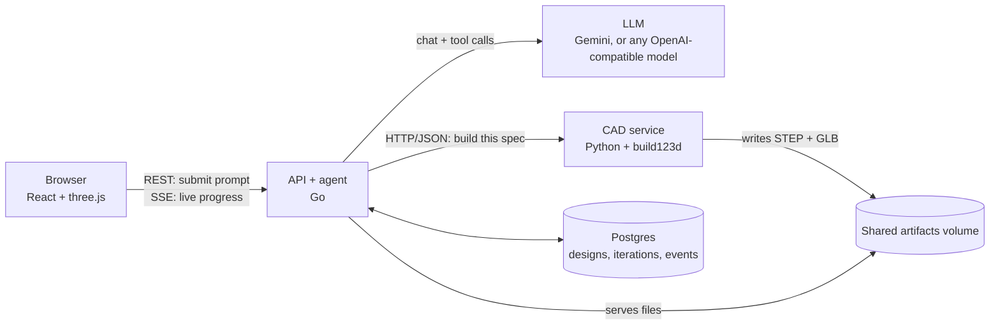

# Text → Spaceship

Type a mission in plain English, such as *"3U CubeSat for Earth imaging with deployable solar panels"*. An AI agent designs a satellite made of multiple parts, builds it as real 3D CAD geometry, checks it against engineering rules, and fixes its own mistakes until the design passes. You watch each attempt live in a 3D viewer, then download the result as CAD files.

> Prototype for the UC Berkeley MEng × NASA capstone *Text to Spaceship: Building for NASA with Agentic Workflows*. The long-term target is NASA's Habitable Worlds Observatory; CubeSats are the first test case.

**New to the project?** Go straight to [Setup](#setup). It walks you through everything, step by step.

## The problem and the approach

AI coding agents can generate a single CAD part, but they struggle with **assemblies**: many parts that must fit together without overlapping, stay attached, and meet size and mass limits.

This project splits the work so each side does what it's good at:

- **The AI decides *what* to build.** It chooses parts from a catalog and places each one, writing the result as a structured JSON document (an *AssemblySpec*). It never writes geometry code.
- **Deterministic code decides *whether it works*.** A CAD engine builds the exact geometry and runs engineering checks. Failures come back with precise numbers, e.g. `battery and avionics overlap by 17280 mm^3`, so the AI knows exactly what to fix.

The rationale is in [ADR 0001](docs/adr/0001-spec-not-code.md).

### Key terms

| Term | Meaning |
|---|---|
| **CubeSat** | A standardized small satellite built from 10 × 10 × 11.35 cm cubes called **units (U)**. A 3U is three cubes long. |
| **Bus** | The satellite's main body. Other parts mount inside it or on its faces. |
| **AssemblySpec** | The JSON design the AI writes: bus size, plus every component with its parameters, position and rotation. |
| **Iteration** | One attempt: the AI submits a spec, and the CAD engine builds and checks it. A run allows up to 6 by default. |
| **STEP / GLB** | Output files. STEP opens in CAD tools (SolidWorks, Fusion, FreeCAD). GLB is a 3D model for web viewers. |

## Architecture



Four services run in Docker Compose. Each has one job:

| Service | Responsibility | Does **not** |
|---|---|---|
| **Web UI** (`web/`) | Sends the prompt, shows the live activity feed, renders the 3D model, lets you step through iterations | hold any state of its own |
| **API + agent** (`api/`) | Public API; runs the agent loop; enforces the iteration budget; saves every design, iteration and event; streams progress; serves the 3D files | touch geometry or know any engineering rules |
| **CAD service** (`cad/`) | Owns the part catalog and the AssemblySpec schema; builds geometry; runs the checks; exports STEP and GLB | call the LLM or store history (it is stateless) |
| **Postgres** | Stores designs, iterations and the ordered event log, so history survives restarts and the live feed can be replayed | store the 3D files, which live on the shared volume |

### What happens when you click "Design it"

1. The browser sends `POST /v1/designs`. The API saves the design in Postgres, starts the agent in the background, and returns immediately with an ID.
2. The browser opens a live event stream (`/v1/designs/{id}/events`) to follow progress.
3. The agent sends the LLM a system prompt (rules plus the part catalog), your request, and two tools: `build_and_validate(spec)` and `finalize(summary)`. The catalog and the tool's input schema come from the CAD service, so there's one source of truth for what a valid spec is.
4. The LLM calls `build_and_validate` with a full AssemblySpec. The API forwards it to the CAD service, which builds the parts, runs the checks, writes `model.step` and `model.glb`, and returns a report.
5. The API saves the iteration, pushes an event to the browser, and returns the report to the LLM as the tool result.
6. If the report has errors, the LLM revises the spec and calls the tool again. When a build passes and the request's requirements are met, the LLM calls `finalize`, which the API only accepts after a passing build.
7. The run ends as **passed** or **failed**. If the provider fails after a passing iteration (for example, a rate limit), the API keeps the latest passing design instead of discarding it.

### What the CAD engine checks

Any **error** fails the build. The agent must fix every error before it can finish.

| Check | Rule |
|---|---|
| **Interference** | No two parts may overlap by more than 1 mm³. |
| **Mounting** | Every part must touch the bus, or a chain of parts that reaches the bus, within 0.5 mm. |
| **Envelope** | Stowed parts must fit the CubeSat outline, plus 6.5 mm allowed protrusion on the side faces. Deployed wings and antennas are exempt. |
| **Mass** | Total mass ≤ 2 kg per U. |
| **Center of mass** | Within ±20 mm of the bus center sideways (±45 mm on a 6U's wide axis). Along the length: ±20 / 45 / 70 / 70 mm for 1U / 2U / 3U / 6U. |
| **Required subsystems** | Must include solar panels, a battery, an electronics stack and an antenna. |

The catalog has 8 parametric parts: camera payload, reaction wheel, star tracker, battery, electronics stack, patch antenna, whip antenna and solar panel (body-mounted or deployed). Buses come in 1U, 2U, 3U and 6U.

**Not checked yet:** structural strength under launch loads, vibration, thermal, power budget over an orbit, or pointing. These are concept-level designs, not flight hardware. See the [Roadmap](#roadmap).

## Tech stack

| Layer | Choice | Why |
|---|---|---|
| CAD kernel | **build123d** on **OpenCascade** (Python) | OpenCascade is the leading open-source CAD kernel, and build123d is a clean Python API for it. It produces exact solids (not meshes), so overlap volumes and distances are real. Python is the only option here, because that's where the kernel lives. |
| CAD service | **FastAPI** + **Pydantic** | Pydantic defines the AssemblySpec once: it validates input and generates the JSON Schema the LLM receives. FastAPI puts it behind a small HTTP API. |
| API + agent | **Go** (standard library HTTP server) | Go is good at the coordination work: many concurrent runs, streaming events, graceful shutdown. It compiles to a small single binary. The agent loop is about 200 lines of plain code, with no framework to learn. |
| LLM access | One **OpenAI-compatible** adapter | Gemini, OpenAI, OpenRouter (open-weight models) and Ollama (local) all speak this API, so changing models is a config change. Each design records its model, which enables comparisons across models. |
| Database | **Postgres**, with **sqlc** and **goose** | Postgres is the standard relational database. sqlc turns hand-written SQL into type-safe Go code (no ORM, i.e. no library that generates the SQL for you). goose applies schema migrations automatically at startup. |
| Live updates | **Server-Sent Events (SSE)** | One-way server → browser streaming over plain HTTP. Browsers reconnect automatically and resume from the last event, which the API replays from Postgres. It's simpler than WebSockets, since the browser never needs to push. |
| Frontend | **React** + **TypeScript** + **Vite** | The standard typed frontend stack. Vite gives fast development builds. |
| 3D viewer | **three.js** via **react-three-fiber** | The standard for 3D in the browser. It loads the GLB directly, keeps part names for hover labels, and highlights failing parts in red. |
| Runtime | **Docker Compose** | One command starts all four services. It also pins the OpenCascade install, which is hard to set up by hand. |
| Quality | **pytest**, **go test**, **ruff**, **gofmt/vet**, **oxlint**, **GitHub Actions** | Every service is tested and linted locally and in CI. |

Choices deliberately left out until they're needed: gRPC (one internal call doesn't justify it), object storage like S3 (a shared volume works on one machine), job queues and Kubernetes. The Roadmap notes where each would come in.

## Setup

No AI or software background needed. Follow the steps in order; the first run takes about 15 minutes, mostly downloads.

### What you're installing, and why

| Tool | What it is | Why we need it |
|---|---|---|
| **Git** | Version control: downloads the code and tracks changes | To get the project onto your computer |
| **Docker Desktop** | Runs programs inside *containers*, pre-packaged mini-computers with everything already installed | Runs the backend (database, CAD engine, API) so you don't have to install Python, OpenCascade or Postgres yourself |
| **Node.js** (version 22) | Runs JavaScript tools | Runs the web page you interact with |
| **Gemini API key** | A password that lets the app use Google's AI model | The AI designer needs it. It's free, and each person gets their own. |

### Step 1: Install the tools

**Mac**
1. Install [Docker Desktop](https://www.docker.com/products/docker-desktop/). Choose "Apple Silicon" or "Intel" to match your Mac ( → About This Mac).
2. Install [Homebrew](https://brew.sh) if you don't have it, then in Terminal run:
   ```bash
   brew install git node
   ```

**Windows**
1. Install [Docker Desktop](https://www.docker.com/products/docker-desktop/). When asked, keep **"Use WSL 2"** checked, and restart if prompted.
2. Open **PowerShell** and run `wsl --install`, then restart. This gives you **Ubuntu**, a Linux terminal where every command below works as written.
3. Open **Ubuntu** from the Start menu and run:
   ```bash
   sudo apt update && sudo apt install -y git make
   curl -fsSL https://deb.nodesource.com/setup_22.x | sudo -E bash - && sudo apt install -y nodejs
   ```
   Run every command from here on inside the Ubuntu terminal.

**Check it worked.** Each command should print a version number:
```bash
git --version
docker --version
node --version     # should start with v22 (v20.19 or newer also works)
```

### Step 2: Get a Gemini API key

1. Go to [aistudio.google.com](https://aistudio.google.com) and sign in with a Google account.
2. Click **Get API key → Create API key**, and copy it.

Treat the key like a password: never paste it into Slack, email or the code.

### Step 3: Download the code and add your key

```bash
git clone https://github.com/adrianapsay/meng-spaceship-prototyping.git
cd meng-spaceship-prototyping
cp .env.example .env
```

Open the new `.env` file in any text editor. Paste your key right after `GEMINI_API_KEY=`, with no spaces or quotes, and save. Git ignores `.env`, so your key never gets uploaded.

### Step 4: Start the backend

Open **Docker Desktop** and wait until it says it's running. Then:

```bash
make up
```

The first time, this downloads and builds everything (about 5–10 minutes). Later starts take seconds. To check it worked, run `docker compose ps`: `postgres`, `cad` and `api` should all show **Up**.

### Step 5: Start the web page

```bash
make web
```

Leave this terminal open; the page stops if you close it. Open **http://localhost:5173** in your browser, pick an example prompt, and click **Design it**.

### Everyday use

| To… | Run |
|---|---|
| Start the backend | `make up` (Docker Desktop must be open) |
| Start the web page | `make web` |
| Stop the backend | `make down` |
| See what the backend is doing | `make logs` (press Ctrl+C to exit) |
| Try the CAD engine without AI | `make example` (needs `uv`, see below) |

### If something goes wrong

| Problem | Fix |
|---|---|
| `Cannot connect to the Docker daemon` | Docker Desktop isn't running. Open it, wait, and retry. |
| `port is already allocated` | Another program is using port 5432, 8000 or 8080. Quit it (often a local Postgres), or ask in Slack. |
| A design fails with **429 Too Many Requests** | Your free AI quota for that model is used up. In `.env`, add `GEMINI_MODEL=gemini-2.5-flash` (each model has its own quota), then run `docker compose up -d api`. |
| Clicking **Design it** seems to do nothing | Run `make logs` and look for red `ERROR` lines. The usual cause is a missing or mistyped key in `.env`. |
| `make: command not found` | Use the Ubuntu terminal on Windows, or run `docker compose up -d --build` and `cd web && npm install && npm run dev` instead. |

### Only if you'll edit the code

The steps above are enough to run the app. To change the code, also install the tools for the part you're working on (Mac: `brew install uv go sqlc`):

| Editing… | You need | Check your work with |
|---|---|---|
| CAD engine (`cad/`, Python) | `uv` | `cd cad && uv run pytest` |
| API and agent (`api/`, Go) | `go` (plus `sqlc` if you change SQL) | `cd api && go test ./...` |
| Web page (`web/`) | nothing extra | `cd web && npx tsc -b` |

After editing the CAD engine or API, run `make up` again to rebuild them. The web page reloads by itself.

### Using the API from a terminal

```bash
curl -X POST localhost:8080/v1/designs -d '{"prompt":"3U CubeSat for Earth imaging with deployable solar panels"}'
curl -N localhost:8080/v1/designs/<id>/events    # follow progress live
```

### Configuration (`.env`)

| Variable | Default | Purpose |
|---|---|---|
| `GEMINI_API_KEY` | none | Enables the Gemini provider |
| `GEMINI_MODEL` | `gemini-flash-latest` | Model to use. Free-tier quotas are per model, so switch here if one is exhausted. |
| `OPENAI_API_KEY`, `OPENROUTER_API_KEY`, `OLLAMA_BASE_URL` (+ `*_MODEL`) | none | Optional extra providers |
| `DEFAULT_PROVIDER` | first configured | Provider used when a request doesn't name one |

## API reference

Public API (Go, port 8080):

| Method | Path | Description |
|---|---|---|
| `POST` | `/v1/designs` | Start a design. Body: `{prompt, provider?, model?, max_iterations?}` (default 6, max 12). Returns `202` with the design. |
| `GET` | `/v1/designs` | 50 most recent designs, with iteration counts |
| `GET` | `/v1/designs/{id}` | One design, plus every iteration's spec, report and file URLs |
| `GET` | `/v1/designs/{id}/events` | Live event stream (SSE): `design.started`, `agent.retrying`, `agent.message`, `iteration.started`, `iteration.completed`, `design.completed` |
| `GET` | `/v1/providers` | Configured LLM providers and their default models |
| `GET` | `/v1/artifacts/{path}` | Download STEP / GLB files |
| `GET` | `/healthz` | Health check (includes the database) |

Internal CAD API (Python, port 8000, called only by the Go API): `GET /schema`, `GET /components`, `POST /build`, `GET /healthz`.

## Repository layout

```
cad/                 Python CAD service
  src/cad/
    components.py    the 8 parametric parts (geometry + mass)
    spec.py          AssemblySpec schema, bus sizes, limits
    build.py         spec → positioned 3D solids
    validate.py      the engineering checks
    export.py        STEP + GLB output
    app.py, cli.py   HTTP API and command-line entry points
  examples/          hand-written reference design
api/                 Go API + agent
  cmd/api/           entry point: config, wiring, graceful shutdown
  internal/agent/    the agent loop and system prompt
  internal/llm/      provider-neutral LLM interface + OpenAI-compatible adapter
  internal/cad/      client for the CAD service
  internal/designs/  design lifecycle: start runs, save results, emit events
  internal/store/    SQL schema, queries, generated Go code (sqlc)
  internal/events/   in-memory fan-out of live events to SSE clients
  internal/httpapi/  routes, handlers, SSE, middleware
web/src/             React UI: prompt form, activity timeline, 3D viewer
docs/adr/            architecture decision records
```

## Development

```bash
make test     # pytest + go test + TypeScript typecheck
make lint     # ruff + gofmt/go vet + oxlint
make logs     # follow api and cad logs
make sqlc     # regenerate Go query code after editing api/internal/store/queries.sql
```

## Roadmap

1. **Evals.** Run a fixed set of prompts across models and measure pass rate and iterations to pass.
2. **Structural screening, then FEA.** First, launch-load and natural-frequency estimates in the validator. Then a finite-element worker (Gmsh + CalculiX) for real stress and vibration results.
3. **MCP server.** Expose the CAD engine as a standard agent tool, so Claude Code, Codex and Gemini agents can design with it directly.
4. **Habitable Worlds Observatory.** A component library for HWO-scale subsystems.
5. **More providers and deployment.** Anthropic adapter, object storage, hosted deployment, tracing.
